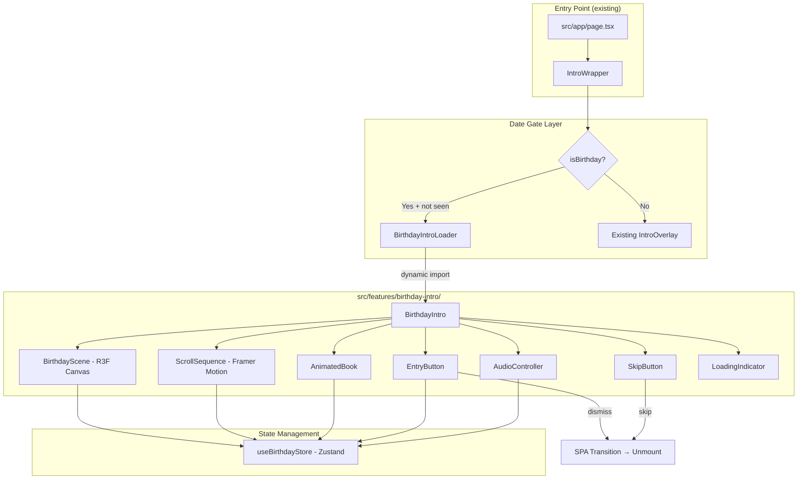
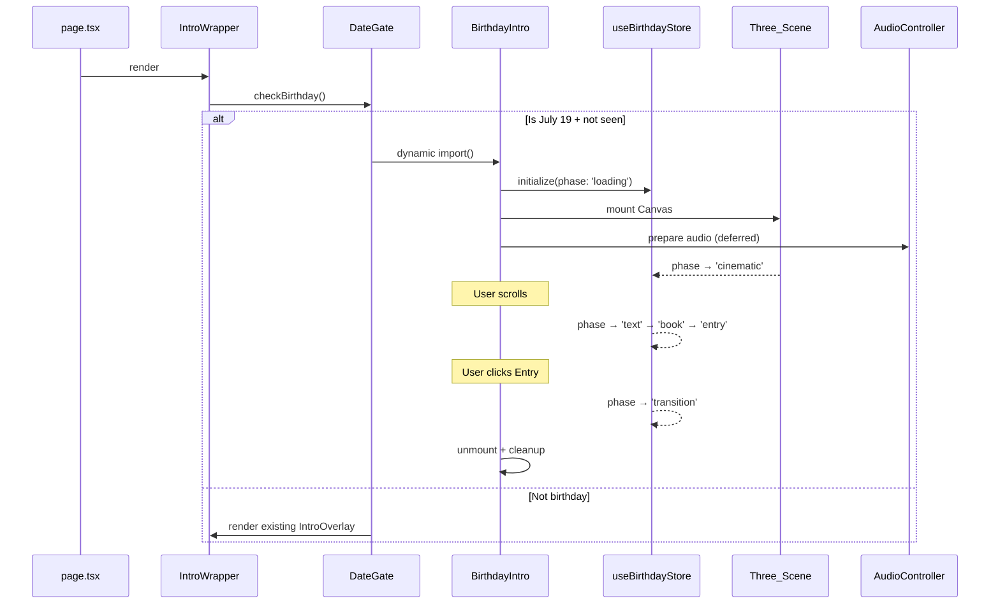

# Design Document: Birthday Landing Page

## Overview

The Birthday Landing Page is a cinematic, scroll-driven 3D experience that appears exclusively on July 19 (Asia/Jakarta timezone) as a full-screen overlay before the main DipCrochet website. It features animated text reveals, a magical opening book with a birthday letter, ambient audio, and premium particle effects — all built with the existing tech stack (React Three Fiber, Framer Motion, Zustand, Tailwind CSS).

The feature is entirely self-contained within `src/features/birthday-intro/` and integrates with the existing homepage via a conditional dynamic import in the existing `IntroWrapper` pattern. On non-birthday days, zero additional JavaScript is loaded.

### Key Design Decisions

1. **Overlay-first architecture** — The birthday intro renders as a fixed `z-[2000]` overlay above the existing intro (`z-[1000]`), preventing any DOM conflicts.
2. **Dynamic import gating** — The Date_Gate check runs first as a lightweight client-side check; only on July 19 does the heavy birthday bundle get dynamically imported.
3. **Scroll-driven state machine** — A Zustand store manages the scroll progress through discrete phases (cinematic → text → book → entry), enabling clean component composition.
4. **Resource lifecycle** — All Three.js resources, audio, and event listeners are disposed via a centralized cleanup function triggered on unmount.

## Architecture



### Data Flow



## Components and Interfaces

### Module Structure

```
src/features/birthday-intro/
├── index.ts                          # Public barrel export
├── components/
│   ├── BirthdayIntroLoader.tsx       # Date gate + dynamic import wrapper
│   ├── BirthdayIntro.tsx             # Root orchestrator component
│   ├── LoadingIndicator.tsx          # Minimal loading UI while assets load
│   ├── SkipButton.tsx                # Persistent skip control
│   ├── AudioToggle.tsx               # Mute/unmute floating button
│   ├── CinematicOpening.tsx          # Black screen → particles → title
│   ├── ScrollSequence.tsx            # Scroll-driven text reveals
│   ├── AnimatedBook.tsx              # Book open + typing effect
│   ├── EntryButton.tsx               # CTA to enter main site
│   └── SpaTransition.tsx             # Exit animation overlay
├── three/
│   ├── BirthdayScene.tsx             # Main R3F Canvas + scene setup
│   ├── ParticleSystem.tsx            # Sakura, hearts, butterflies, stars, dust
│   ├── YarnBalls.tsx                 # Instanced crochet yarn balls
│   ├── CrochetFlowers.tsx            # Instanced crochet flowers
│   ├── Clouds.tsx                    # Volumetric cloud meshes
│   ├── AnimeSilhouette.tsx           # Couple illustration (sprite/plane)
│   ├── CinematicLighting.tsx         # Sunset lighting + bloom config
│   ├── ParallaxCamera.tsx            # Mouse/touch-reactive camera
│   └── PostProcessing.tsx            # Bloom, DOF, light rays
├── hooks/
│   ├── useBirthdayStore.ts           # Zustand store for all state
│   ├── useDateGate.ts                # Birthday date check + session logic
│   ├── useScrollProgress.ts          # Scroll position → normalized 0-1
│   ├── useAudioController.ts         # Audio playback, fade, mute logic
│   └── useResourceDisposal.ts        # Cleanup on unmount
├── utils/
│   ├── dateCheck.ts                  # Pure function: is it July 19 in Asia/Jakarta?
│   ├── scrollMath.ts                 # Scroll → phase mapping utilities
│   └── constants.ts                  # Timing, colors, text content
├── assets/
│   ├── audio/                        # Birthday instrumental track (.mp3)
│   └── textures/                     # Book leather, particle sprites (max 512/1024px)
└── types.ts                          # Shared TypeScript types
```

### Core Interfaces

```typescript
// types.ts
export type BirthdayPhase =
  | 'loading'
  | 'cinematic'
  | 'text'
  | 'book'
  | 'entry'
  | 'transition'
  | 'done';

export interface BirthdayState {
  phase: BirthdayPhase;
  scrollProgress: number;        // 0 to 1 across entire scroll height
  isMuted: boolean;
  audioReady: boolean;
  hasInteracted: boolean;
  isReducedMotion: boolean;
  isMobile: boolean;
  assetsLoaded: boolean;
}

export interface BirthdayActions {
  setPhase: (phase: BirthdayPhase) => void;
  setScrollProgress: (progress: number) => void;
  toggleMute: () => void;
  setHasInteracted: () => void;
  setAssetsLoaded: () => void;
  dismiss: () => void;
}

// useDateGate return type
export interface DateGateResult {
  isBirthday: boolean;
  hasSeenThisSession: boolean;
  markAsSeen: () => void;
}
```

### Component Contracts

| Component | Props | Responsibility |
|-----------|-------|---------------|
| `BirthdayIntroLoader` | none | Checks date gate, dynamically imports `BirthdayIntro`, renders loading state |
| `BirthdayIntro` | none | Orchestrates all sub-components, manages scroll container, handles lifecycle |
| `BirthdayScene` | `{ phase, scrollProgress, isMobile, isReducedMotion }` | Renders R3F Canvas with all 3D elements |
| `ParticleSystem` | `{ phase, scrollProgress, isMobile }` | Manages instanced particle meshes (sakura, hearts, etc.) |
| `ParallaxCamera` | `{ isMobile, isReducedMotion }` | Applies mouse/touch parallax to camera (max ±0.3 units) |
| `CinematicOpening` | `{ phase }` | Black screen → particle fade → title reveal (timed sequence) |
| `ScrollSequence` | `{ scrollProgress }` | Maps scroll to text line reveals with Framer Motion |
| `AnimatedBook` | `{ scrollProgress, phase }` | Book appearance, page turn, typing effect |
| `EntryButton` | `{ onEnter }` | Glowing CTA button with keyboard support |
| `SkipButton` | `{ onSkip }` | Persistent top-right skip control |
| `AudioToggle` | none | Mute/unmute button (reads from store) |
| `SpaTransition` | `{ onComplete }` | Camera forward + fade-to-white exit animation |
| `LoadingIndicator` | none | Minimal animated indicator during asset loading |

### Integration Point

The integration requires a **single modification** to `src/features/intro/components/IntroWrapper.tsx`:

```typescript
// IntroWrapper.tsx — modified to support birthday gate
"use client";

import dynamic from "next/dynamic";
import { useDateGate } from "@/features/birthday-intro/hooks/useDateGate";

const IntroOverlay = dynamic(() => import("./IntroOverlay"), { ssr: false });
const BirthdayIntroLoader = dynamic(
  () => import("@/features/birthday-intro/components/BirthdayIntroLoader"),
  { ssr: false }
);

export default function IntroWrapper() {
  const { isBirthday, hasSeenThisSession } = useDateGate();

  if (isBirthday && !hasSeenThisSession) {
    return <BirthdayIntroLoader />;
  }

  return <IntroOverlay />;
}
```

> **Note:** This is the only existing file that gets modified. The `useDateGate` hook is a tiny pure function import that adds negligible bytes. The actual birthday bundle is loaded dynamically only when needed.

## Data Models

### Zustand Store Schema

```typescript
// useBirthdayStore.ts
import { create } from 'zustand';
import type { BirthdayState, BirthdayActions, BirthdayPhase } from '../types';

const SESSION_KEY = 'dip_birthday_seen';

interface BirthdayStore extends BirthdayState, BirthdayActions {}

export const useBirthdayStore = create<BirthdayStore>((set) => ({
  // State
  phase: 'loading',
  scrollProgress: 0,
  isMuted: false,
  audioReady: false,
  hasInteracted: false,
  isReducedMotion: false,
  isMobile: false,
  assetsLoaded: false,

  // Actions
  setPhase: (phase) => set({ phase }),
  setScrollProgress: (scrollProgress) => set({ scrollProgress }),
  toggleMute: () => set((state) => ({ isMuted: !state.isMuted })),
  setHasInteracted: () => set({ hasInteracted: true }),
  setAssetsLoaded: () => set({ assetsLoaded: true }),
  dismiss: () => {
    try {
      sessionStorage.setItem(SESSION_KEY, '1');
    } catch {
      // sessionStorage unavailable — allow repeat shows per Req 12.5
    }
    set({ phase: 'done' });
  },
}));
```

### Scroll-to-Phase Mapping

```typescript
// scrollMath.ts
import type { BirthdayPhase } from '../types';

// Total scroll height: ~5 viewport heights (5 * 100vh)
export const SCROLL_SECTIONS = {
  cinematic: { start: 0, end: 0.15 },      // 0–15%: timed cinematic (auto-plays)
  text:      { start: 0.15, end: 0.50 },   // 15–50%: scroll-driven text reveals
  book:      { start: 0.50, end: 0.85 },   // 50–85%: book open + letter typing
  entry:     { start: 0.85, end: 1.0 },    // 85–100%: entry button visible
} as const;

export function scrollToPhase(progress: number): BirthdayPhase {
  if (progress < SCROLL_SECTIONS.cinematic.end) return 'cinematic';
  if (progress < SCROLL_SECTIONS.text.end) return 'text';
  if (progress < SCROLL_SECTIONS.book.end) return 'book';
  return 'entry';
}
```

### Constants

```typescript
// constants.ts
export const BIRTHDAY_DATE = { month: 7, day: 19 }; // July 19
export const TIMEZONE = 'Asia/Jakarta';

export const COLORS = {
  softPink: '#FFB6C1',
  blushPink: '#FFE4E1',
  rosePink: 'rgba(255, 105, 180, 0.6)',
  white: '#FFFFFF',
  cream: '#FFFDD0',
  lightGold: 'rgba(255, 215, 0, 0.4)',
  softPurple: '#E6E6FA',
  black: '#000000',
} as const;

export const TIMING = {
  blackScreen: 500,        // ms
  particleFadeIn: 1500,    // ms
  cameraReveal: 2000,      // ms
  titleReveal: 1500,       // ms
  nameReveal: 1200,        // ms
  audioFadeIn: 2000,       // ms
  audioFadeOut: 1500,      // ms
  textLineFadeIn: 600,     // ms
  bookAppear: 800,         // ms
  pageTurn: 1200,          // ms
  typingSpeed: { min: 30, max: 50 }, // chars per second
  entryButtonFadeIn: 600,  // ms
  spaTransition: { min: 1500, max: 3000 }, // ms
  skipTransition: 500,     // ms
} as const;

export const INTRO_LINES = [
  'Happy Birthday...',
  'Dinar Intan Permatasari...',
  'Today is your day...',
  'Every stitch you make brings warmth.',
  'Every smile you give makes my world brighter.',
] as const;

export const BIRTHDAY_LETTER = `Happy Birthday.
Makasih ya udah lahir ke dunia dan hadir di hidup aku.
Aku sering mikir, kalau waktu itu kita gak dipertemukan, mungkin hidup aku gak akan sehangat sekarang.
Buat aku, kamu bukan cuma seseorang yang aku sayang, tapi juga rumah tempat hati ini selalu ingin pulang.
Aku gak bisa janji perjalanan kita selalu mudah, tapi aku janji akan selalu berusaha tetap menggenggam tangan kamu, apa pun yang terjadi.
Semoga tahun ini membawa lebih banyak bahagia, kesehatan, rezeki, dan mimpi yang pelan-pelan jadi nyata.
I love you, today, tomorrow, and every day after that. ❤️`;

export const AUDIO_CONFIG = {
  volume: 0.2,
  fadeInDuration: 2,  // seconds
  fadeOutDuration: 1.5,
} as const;
```

### Session Storage Schema

| Key | Value | Purpose |
|-----|-------|---------|
| `dip_birthday_seen` | `"1"` | Prevents re-showing birthday intro in same session |

The existing `cotcret_intro_seen` key from the regular intro remains independent — the birthday intro manages its own session state.

## Correctness Properties

*A property is a characteristic or behavior that should hold true across all valid executions of a system — essentially, a formal statement about what the system should do. Properties serve as the bridge between human-readable specifications and machine-verifiable correctness guarantees.*

### Property 1: Date gate activates exclusively on July 19 Asia/Jakarta

*For any* timestamp representable as a JavaScript Date, the `isBirthdayToday()` function SHALL return `true` if and only if the date portion in the Asia/Jakarta timezone (UTC+7) is July 19, regardless of the hour, minute, or second within that day, and regardless of what timezone the host machine is configured to.

**Validates: Requirements 1.1, 1.2, 1.3**

### Property 2: Session flag prevents re-display after dismissal

*For any* sequence of operations where `markAsSeen()` is called (via Entry_Button or Skip_Button), all subsequent calls to check `hasSeenThisSession` SHALL return `true` for the remainder of the session, regardless of navigation events, scroll position changes, or phase transitions that occur between the mark and the check.

**Validates: Requirements 1.5, 12.1, 12.3**

### Property 3: Session flag is not set before explicit dismissal

*For any* state of the Birthday_Intro where `dismiss()` has NOT been called, the sessionStorage key `dip_birthday_seen` SHALL NOT exist, ensuring that page refresh or tab close before completion allows the intro to show again.

**Validates: Requirements 12.4**

### Property 4: Particle velocity and oscillation constraints

*For any* particle in the Particle_System at any point in time, its computed linear velocity SHALL NOT exceed 0.5 scene units per second, and its full oscillation cycle SHALL have a period of at least 4 seconds.

**Validates: Requirements 4.4**

### Property 5: Camera parallax offset is bounded

*For any* mouse position (normalized to [-1, 1] on both axes) or touch/tilt input value, the computed Parallax_Camera offset from center SHALL NOT exceed 0.3 scene units in any axis (x, y, or z).

**Validates: Requirements 4.5, 4.6**

### Property 6: Scroll-to-visibility is monotonically non-decreasing

*For any* two scroll progress values `a` and `b` where `a < b`, the number of visible intro text lines at progress `b` SHALL be greater than or equal to the number of visible lines at progress `a`. Equivalently, scrolling forward never hides previously revealed lines, and scrolling backward never shows lines that weren't yet triggered.

**Validates: Requirements 5.1, 5.5**

### Property 7: Typing effect rate is within bounds

*For any* text content and any elapsed time `t` after the typing effect starts, the number of revealed characters SHALL be between `floor(30 * t)` and `ceil(50 * t)` characters (where t is in seconds), clamped to the total text length.

**Validates: Requirements 6.4**

### Property 8: No forbidden color tones in palette

*For any* color value defined in the Birthday_Intro's design token constants or applied to visible DOM/Three.js elements, when converted to HSL, it SHALL NOT simultaneously have a hue between 350° and 10° (wrapping), saturation above 80%, and lightness below 50%.

**Validates: Requirements 13.2**

## Error Handling

### WebGL Failure (Requirement 4.7)

- **Detection**: Wrap Canvas mount in try/catch and listen for WebGL context creation failure events.
- **Fallback**: Render a static gradient background image with the birthday text content displayed as Framer Motion fade-in elements. Disable particle system and 3D scene entirely.
- **User path**: The Entry_Button remains accessible so the visitor can still proceed to the main site.

### Audio Load Failure (Requirement 8.6)

- **Detection**: Listen for `error` event on the HTMLAudioElement and timeout after 5 seconds.
- **Fallback**: Set `audioReady: false` in the store. The AudioToggle component renders in a disabled/grayed state. The birthday experience continues silently.
- **No user impact**: The intro is fully functional without audio.

### SessionStorage Unavailability (Requirement 12.5)

- **Detection**: Wrap `sessionStorage.setItem`/`getItem` in try/catch.
- **Fallback**: If reads throw, `hasSeenThisSession` defaults to `false` (show intro). If writes throw, the intro will show again on next visit but no error surfaces to the user.

### Asset Loading Failure

- **Detection**: Promise rejection from dynamic imports or texture/model loading.
- **Fallback**: Display a minimal "loading failed" message within the loading indicator, with a "Skip to site" link that calls `dismiss()`.
- **Timeout**: If assets haven't loaded within 10 seconds, auto-show skip prompt.

### Performance Degradation

- **Detection**: Monitor frame rate via `useFrame` callback; if average FPS drops below 20 for 3 consecutive seconds, trigger quality reduction.
- **Adaptation**: Reduce particle count by 50%, disable post-processing effects (bloom, DOF), lower texture resolution.

## Testing Strategy

### Unit Tests (Example-based)

Unit tests cover specific behaviors, edge cases, and integration points:

| Area | Test Cases |
|------|-----------|
| `dateCheck.ts` | Specific boundary examples: July 18 23:59 UTC (is July 19 WIB), July 19 16:59 UTC (still July 19 WIB), July 19 17:00 UTC (is July 20 WIB) |
| `useDateGate` | Session storage interactions, graceful fallback when storage unavailable |
| `scrollMath.ts` | Boundary values: progress=0, 0.15, 0.5, 0.85, 1.0 map to correct phases |
| `useBirthdayStore` | Phase transitions, dismiss sets session flag, toggleMute flips state |
| Constants | INTRO_LINES content matches spec, BIRTHDAY_LETTER matches spec, COLORS values match spec |
| Components | SkipButton renders with correct ARIA, EntryButton keyboard handling, AudioToggle disabled state |
| Accessibility | Focus order, ARIA labels, reduced-motion handling |
| Reduced motion | With prefers-reduced-motion, verify static content, 300ms fade durations |

### Property-Based Tests

Property-based tests validate universal properties across randomized inputs. Each test runs a minimum of **100 iterations** using `fast-check` (already compatible with the project's TypeScript/Node setup).

| Property # | Test Description | Generator Strategy |
|-----------|-----------------|-------------------|
| 1 | Date gate exclusivity | Generate random Date objects across all months/days/hours; some forced to July 19 WIB boundaries |
| 2 | Session persistence after mark | Generate random sequences of markAsSeen + hasSeenThisSession checks |
| 3 | No premature session flag | Generate random phase transition sequences without dismiss; verify storage empty |
| 4 | Particle velocity bounds | Generate random elapsed times and positions; compute velocity; assert <= 0.5 |
| 5 | Camera offset bounds | Generate random mouse/touch coordinates in [-1, 1]; compute offset; assert <= 0.3 |
| 6 | Scroll visibility monotonicity | Generate pairs of scroll values (a, b) where a < b; assert visibleLines(a) <= visibleLines(b) |
| 7 | Typing rate bounds | Generate random elapsed times; assert revealed chars within [30t, 50t] bounds |
| 8 | Color constraint | Generate/enumerate all color constants; convert to HSL; assert no forbidden combination |

**PBT Library**: `fast-check` — lightweight, TypeScript-native, zero dependencies beyond dev.

**Tag format**: Each property test is tagged with a comment:
```typescript
// Feature: birthday-landing-page, Property 1: Date gate activates exclusively on July 19 Asia/Jakarta
```

### Integration Tests

| Scenario | Verification |
|----------|-------------|
| Full lifecycle | Mount → cinematic → scroll → book → entry → unmount; verify cleanup |
| WebGL fallback | Force WebGL failure → verify static fallback renders |
| Audio fallback | Force audio load error → verify intro continues |
| Bundle size | Build with feature → verify gzipped delta <= 150KB |
| Mobile responsiveness | Render at 320px, 768px, 1024px, 2560px → no overflow |

### Visual / Manual Tests

- Color harmony and premium feel
- Animation smoothness (60fps desktop, 30fps mobile)
- Font rendering quality
- Anime silhouette artistic quality
- Touch scroll feel on mobile devices

